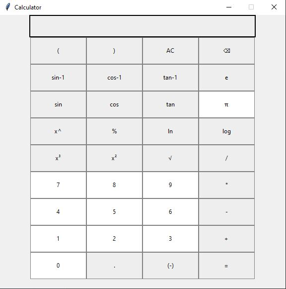
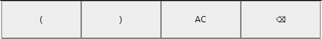
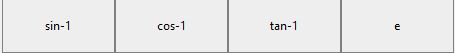
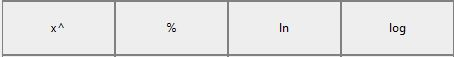
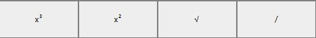
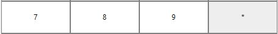
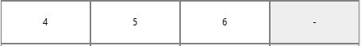
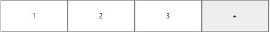
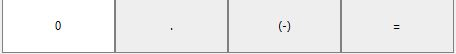

# Introducing: Python Calculator made with the tkinter module
## to install tkinter, open terminal (mac/linux) or command prompt on windows and type: pip install tkinter
### other pip installs for this app to work for you: pip install numpy , pip install math

#### for special buttons to work like square root or x squared, first select a number and then something like x squared or sin)

# Image of calculator (will make it look better in the future, but all the buttons work):

### First row: 

* right & left paranthesis (for more complex calculations like: (1+1)+(1*1)=3)
* AC (all clear): clear entire input section
* ⌫ : delete one input

### Second row: Inversed trig 

* inverse sin
* inverse cos
* inverse tan
* e : 2.7182818284590452353602874713527 (and infinitely more decimals)

### Third row: Trig 

* sin
* cos
* tan
* π : 3.141592653589793238 (and infinitely more decimals)

### Fourth row: 

* x^ : raise x to the power of anything 
* % : percentage of a number / 100 
* ln 
* log 

### Fifth row:

* x³ : x cubed 
* x² : x squared 
* √ : square root (or x to the power of 0.5)
* /: division 

### Sixth row:

* 7
* 8 
* 9
* *: multiplication 

### Seventh row:

* 4
* 5
* 6
* -: subtraction 

### Eighth row:

* 1
* 2
* 3
* +: addition 

### Ninth row:

* 0
* .: decimal
* (-) : make a number negative 
* = : equals sign and compute calculation 

#### please feel free to give constructive feedback or praise. Also, feel free to fork & clone this repo and change it to however you like! Python is very mathematical and great for advanced stuff like A.I. and machine learning. happy coding! 
